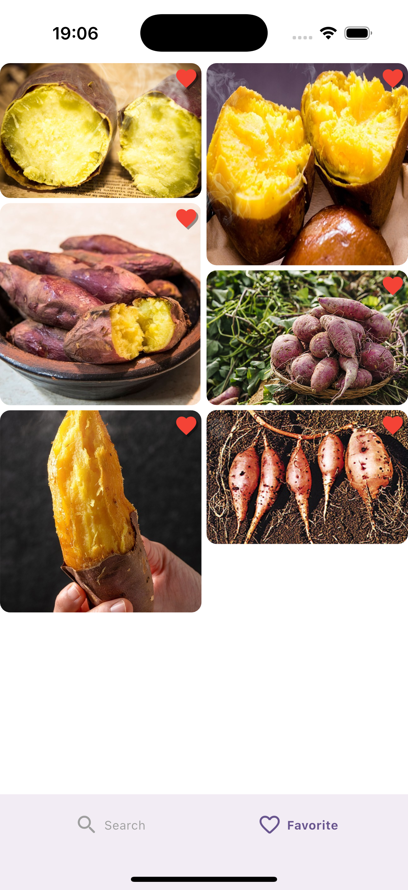

# Image List App

이미지 검색 및 관리 애플리케이션입니다.

## ✨ 주요 기능

- 이미지 검색 (카카오 검색 API 사용)
- 검색 결과 저장
- 로컬 스토리지 지원

## 🛠 기술 스택

- Flutter
- GetX (상태 관리)
- GetStorage (로컬 스토리지)
- Flutter Dotenv (환경 변수 관리)

## 📱 스크린샷

  <table>
    <tr>
      <td align="center">
        
         
        <strong>검색 화면</strong>
      </td>
      <td align="center">
        
         
        <strong>검색 결과 화면</strong>
      </td>
      <td align="center">
        
         
        <strong>이미지 상세</strong>
      </td>
    </tr>
     <tr>
      <td align="center">
        
         
        <strong>즐겨찾기 추가</strong>
      </td>
      <td align="center">
        
         
        <strong>즐겨찾기 빈 화면</strong>
      </td>
      <td align="center">
        
         
        <strong>즐겨찾기 화면</strong>
      </td>
    </tr>
  </table>

